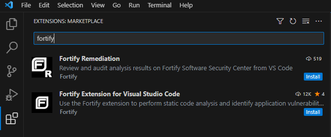

Follow this guide to learn how to quickly install the Fortify extension for VSCode.
With this plugin you will be able to scan and review source code vulnerabilities.

<!-- more -->

Two plugins are available for VSCode

- **Fortify Remediation** - this allows a developer to review and audit vulnerabilities
- **Fortify Extensions for Visual Studio** - this allows a user to scan source code and publish scan results to a security dashboard

## Installation Steps
1. Open VSCode and click on the **extensions** icon.
2. Search for **fortify** in the extensions search bar.
3. Click the **install** button either plugin.

!!! success "**CONGRATULATIONS! YOU'VE SUCCESSFULLY INSTALLED THE FORTIFY EXTENSION(S) FOR VISUAL STUDIO CODE**"